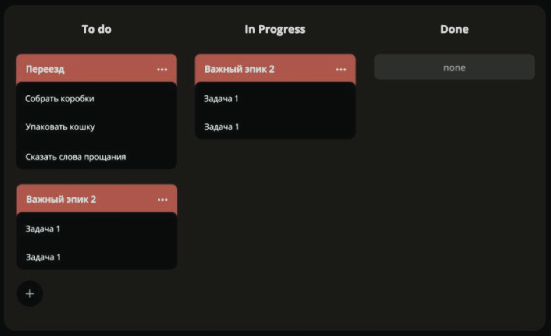
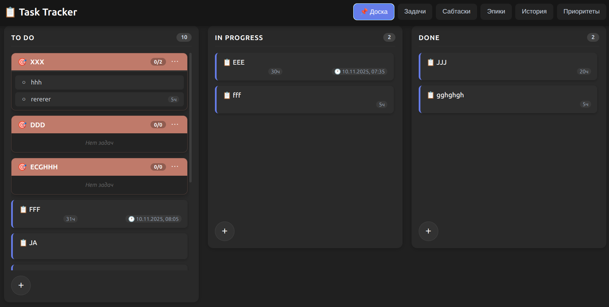
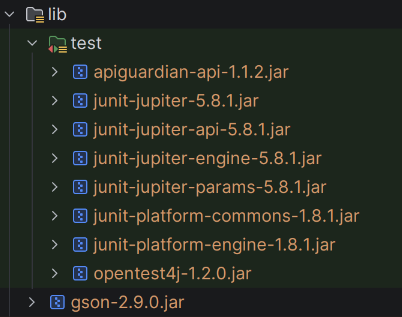

# java-kanban

## Трекер задач

**Учебный проект**

Идея

Реализация

### Типы задач
- Подзадача (Subtask)
- Задача (Task)
- Эпик (Epic)

### Статусы задач
- NEW
- IN_PROGRESS
- DONE

### Основные возможности
- Добавление задач
- Удаление задач
- Обновление задач
- Просмотр истории изменения задач
- Просмотр в порядке приоритетности

### Хранение данных
Данные задач хранятся в таблице CSV  
(создается автоматически в корне проекта)

Есть возможность работы только в оперативной памяти, без csv   
История изменений всегда хранятся только в оперативной памяти  

### Frontend
- JavaScript

### HTTP server
Endpoints:
- /tasks
- /subtasks
- /epics
- /history
- /prioritized

### Console CLI
Commands:
- help
- update
- print
- history
- find
- add-task
- add-epic
- add-sub
- set-status
- set-time
- set-dur
- remove
- exit

### Как запустить
- Склонировать проект
- Добавить необходимые библиотеки

- Запустить HttpTaskServer.java
- Открыть в браузере localhost:8080

Для использования консоли, запустить ConsoleCLI.java

